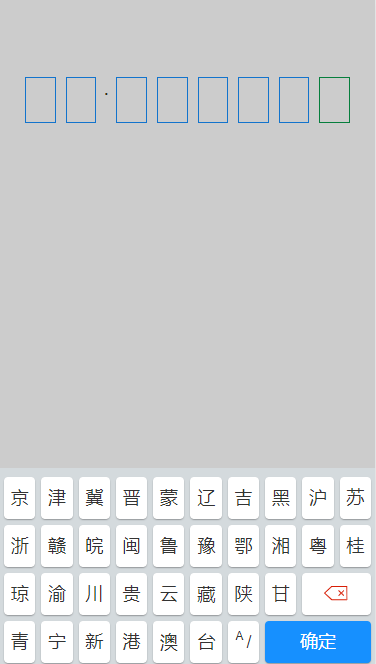
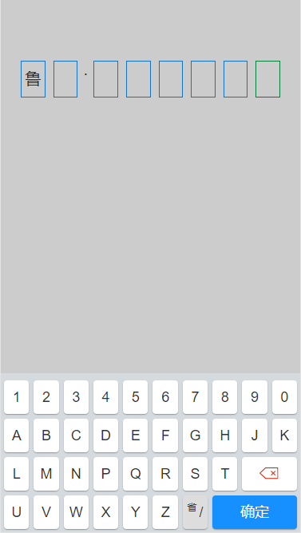
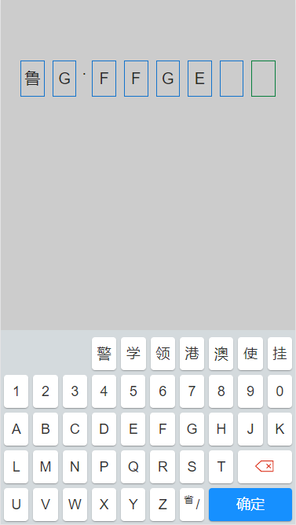
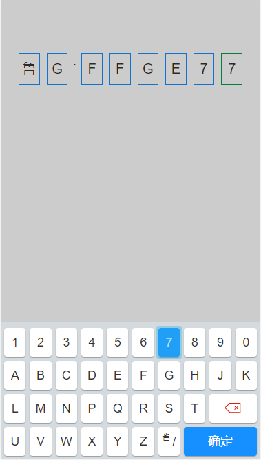

# licence-keyboard

一个自定义车牌号输入键盘






## 安装

```
npm i licence-keyboard
```

## 使用

```js
import Vue from 'vue'
import licenceKeyboard from 'licence-keyboard'
Vue.use(licenceKeyboard)

```
组件中
``` html
<template>
  <div>
    <licence-keyboard v-model="carId">
      <!-- 这里为slot -->
      <div>{{carId}}</div>
    </licence-keyboard>
  </div>
</template>

```

## api

| 属性           | 类型          | 说明                           | 默认    |
| -------------- | ------------- | ------------------------------ | ------- |
| value(v-model) | array[string] | 输入的车牌号                   | []      |
| isMask         | boolean       | 是否展示遮罩层                 | true    |
| licenceLength  | Number        | 车牌号的长度（默认包含新能源） | 8       |
| slot           | slot          | 车牌号展示的内容               | default |

